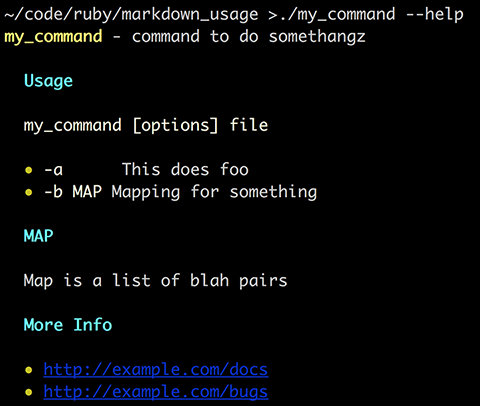

# MarkdownUsage

Output a colorized version of your program's usage using a Markdown document embedded in your script, from your project's README, or anywhere else.

`MarkdownUsage` uses [`TTY::Markdown`](https://github.com/piotrmurach/tty-markdown) to make
your program's usage look like this:



## Installation

Add this line to your application's Gemfile:

**Note: gem is not yet published**

```ruby
gem "markdown_usage"
```

And then execute:

    $ bundle

Or install it yourself as:

    $ gem install markdown_usage

## Usage

The Markdown can come from a file or from [your program's `__END__` section](http://ruby-doc.org/docs/keywords/1.9/Object.html#method-i-__END__).

By default `MarkdownUsage.print` will output to `stderr` and call
`exit 0`. To change this see [Options](#options).

Alternatively you can call `MarkdownUsage()`.

### Using `__END__`

Add the Markdown to your script and call `MarkdownUsage.print` when
it's time to display the usage:

```rb
#!/usr/bin/ruby

require "optparse"
require "markdown_usage"

OptionParser.new do |opts|
  opts.on "-h", "--help" do
    MarkdownUsage.print
  end

  opts.on "-o", "--do-something", "My great option" do |opt|
    # ...
  end
end.parse!

# The rest of your amazing program

__END__
**my_command** - command to do somethangz

## Usage

`my_command [options] file`

  * `-a`      This does foo
  * `-b``MAP` Mapping for something

## MAP

Map is a list of blah pairs

## More Info

- [Docs](http://example.com/docs)
- [Bugs](http://example.com/bugs)

```

Note that `OptionParser` is in the example but is not required.

### Using a File

To use a file specify its path:

```rb
MarkdownUsage.print(:source => "path/to/README")
```

In most cases you'll want to extract the program's usage from the `Usage`
section of your project's README:

```rb
MarkdownUsage.print(:source => "README", :sections => "Usage")
```

This will extract a Markdown formatted README from your project's root directory.

If your project is released as a gem, add `README.md` (or
`README.markdown`) to the gem's list of files:

```rb
s.extra_rdoc_files = %w[README.md]
s.files = Dir["lib/**/*.rb"] + s.test_files + s.extra_rdoc_files
```

### Options

`MarkdownUsage.print` and `MarkdownUsage()` accept a `Hash` of the following options:

#### `:exit`

Exit status to use after printing usage, defaults to `0`.

Set this to `false` to prevent `exit` from being called.

#### `:output`

File handle to output the usage on. Defaults to `$stdout`. The given handle must
have a `#puts` method.

The usage will *always* contain terminal escape codes.

#### `:sections`

Sections to extract from `:output`. These must be the headings used in the README.

#### `:source`

Location of usage Markdown to print, defaults to your programs's  `__END__` section.

To load a Markdown `README` from your project's root directory set this to `README`.

Relative paths will be loaded relative to your project's root directory. This assumes
your executable is in `ROOT/bin`.

#### `:raise_errors`

If `true` a `MarkdownUsage::Error` will be raised when `MarkdownUsage` encounters a problem.
If `false` a warning is sent to `stderr` instead.

## See Also

- [`TTY::Markdown`](https://github.com/piotrmurach/tty-markdown) - without this there would be no `MarkdownUsage`
- Perl's [`Pod::Usage`](https://metacpan.org/pod/Pod::Usage) - the inspiration for `MarkdownUsage`


## License

The gem is available as open source under the terms of the [MIT License](https://opensource.org/licenses/MIT).
